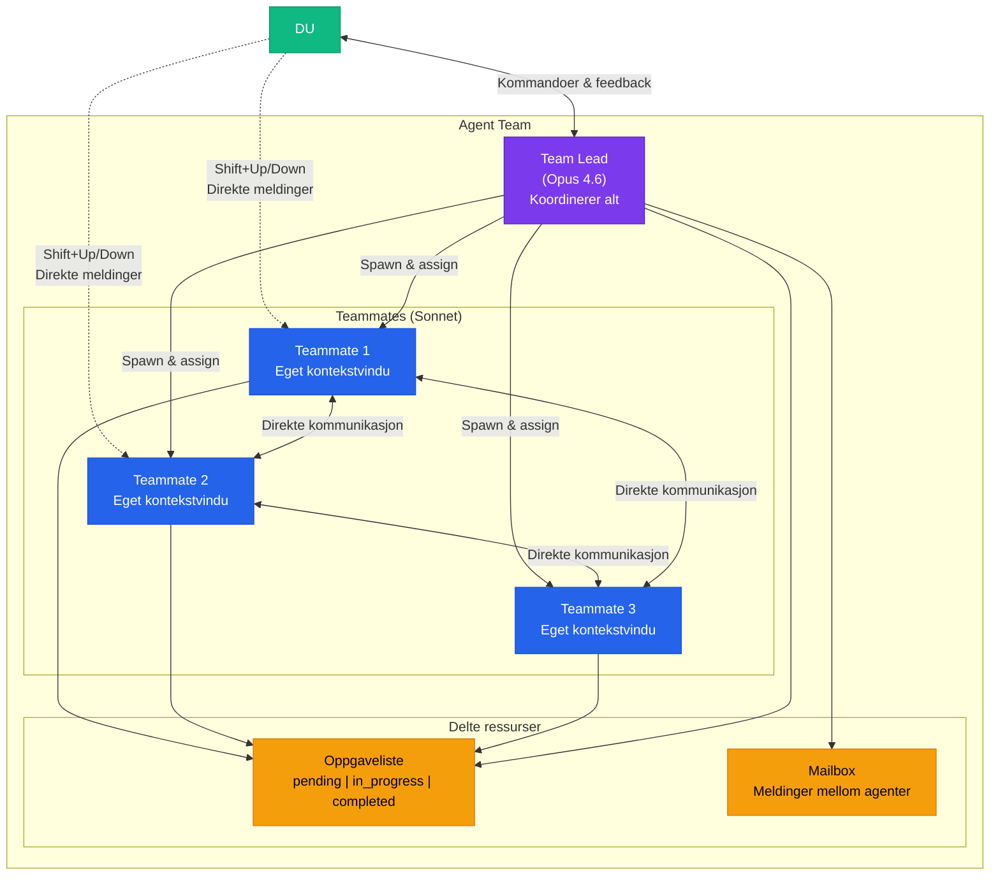
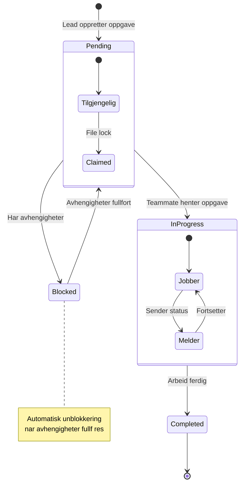
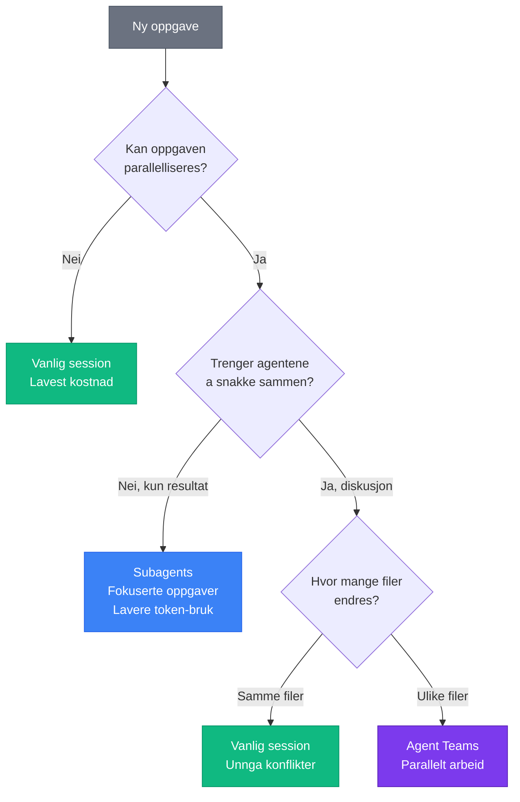
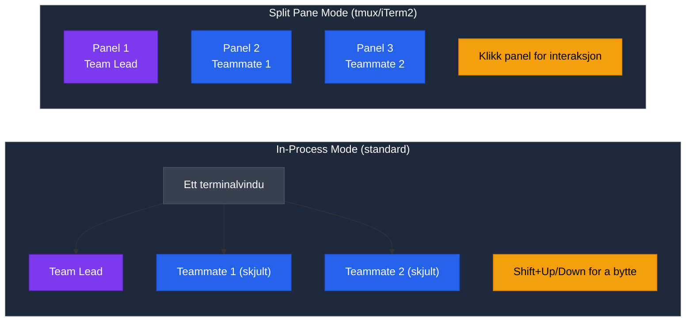
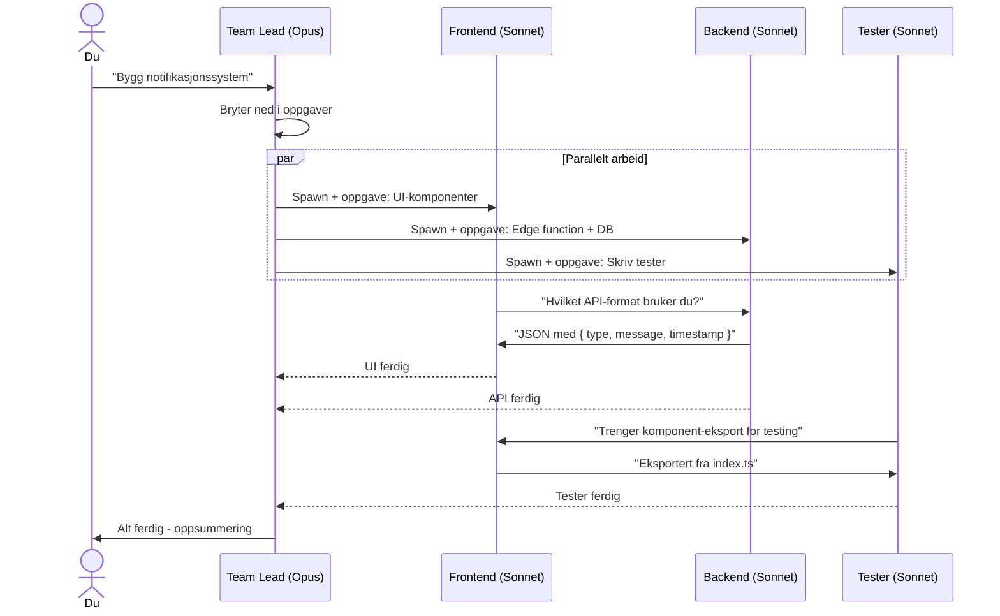
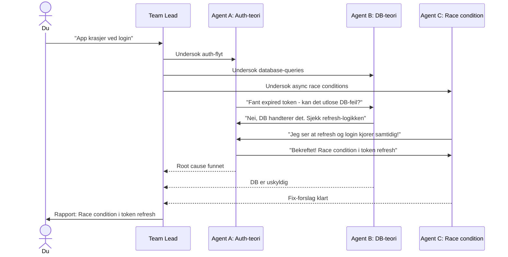
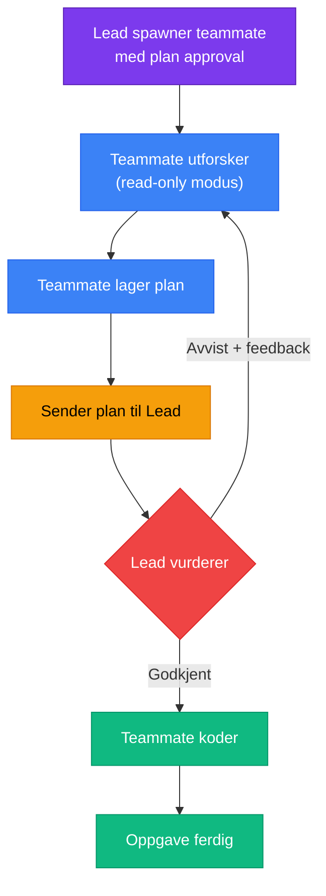
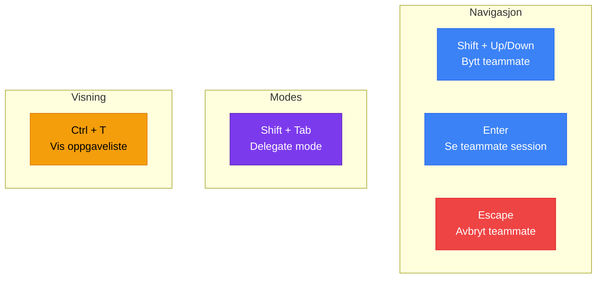
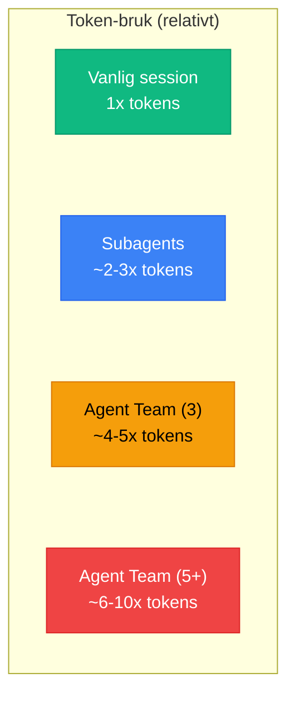
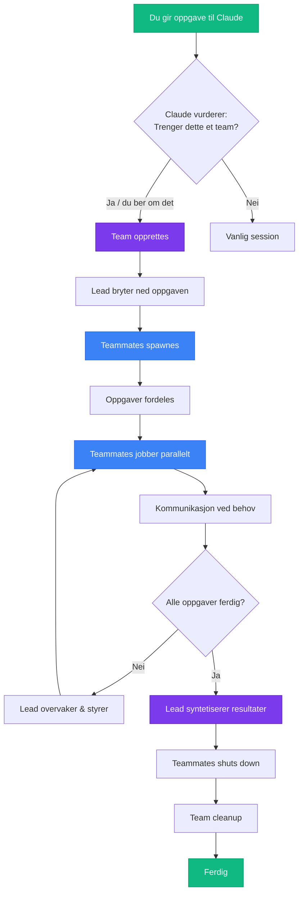

# Agent Teams - Visuell Guide

> Klikk p en seksjon for  se diagrammet. Bruk denne som referanse sammen med [agent-teams-oppsett.md](./agent-teams-oppsett.md)

---

## Oversikt - Arkitektur

<strong>Hvordan Agent Teams er bygget opp</strong>

---

## Oppgaveflyt

<strong>Hvordan oppgaver flyter gjennom teamet</strong>

---

## Beslutningstre - Nar bruke hva

<strong>Skal du bruke Agent Teams, Subagents, eller vanlig session?</strong>

---

## Display Modes

<strong>In-process vs Split panes</strong>

---

## Eksempel: Feature-bygging

<strong>Slik ser en typisk feature-build ut med 3 teammates</strong>

---

## Eksempel: Debugging-battle

<strong>Konkurrerende hypoteser for feilsoking</strong>

---

## Plan Approval Flow

<strong>Nar teammates ma fa godkjenning for de koder</strong>

---

## Hurtigreferanse - Tastatur

<strong>Alle hurtigtaster for agent teams</strong>

---

## Token-kostnad

<strong>Kostnadssammenligning mellom tilnarminger</strong>

---

## Livssyklus

<strong>Full livssyklus for et agent team</strong>

